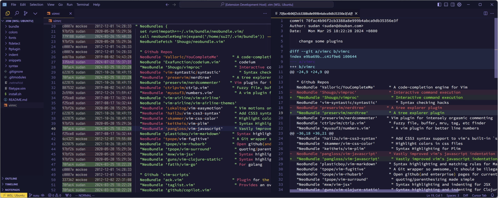

# Show Me in GitHub

An extension for viewing blame information and commit details in VS Code, and copy file/commit URL in GitHub/GitHub Enterprise. Quickly navigate with keyboard shortcuts.

There are a lot of similar extensions, but I love vim-fugitive so much and I want to mimic part of its functionality.



## Features

- Open current file/lines in GitHub or GitHub Enterprise
- Show Git blame information with color-coded timestamps

### Open in GitHub (`Alt+, w`)
- Open file in GitHub
- Support line number selection
- Support commit URL in diff view

### Git Blame Information (`Alt+, b`)
- Toggle Git blame information display
- Shows commit hash, author, and timestamp
- Color-coded: newer commits appear brighter

### View Commit Details (`Alt+, s`)
- Show commit details for the current line
- Shows the commit changes in vs code diff view

## Installation

Install from VS Code Marketplace or download VSIX file from [releases](https://github.com/su27/show-in-github/releases).

## Usage

### Keyboard Shortcuts

Default shortcuts:
- `Alt+, w` - Open in GitHub
- `Alt+, b` - Toggle Git Blame information
- `Alt+, s` - Show commit details for current line

To customize these shortcuts:
1. Open Keyboard Shortcuts in VS Code:
   - Windows/Linux: Press `Ctrl+K Ctrl+S`
   - Mac: Press `Cmd+K Cmd+S`
2. Search for "Show Me in GitHub" to see all commands
3. Click the pencil icon next to any command to edit its shortcut
4. Press your desired key combination
5. Press Enter to save

Or directly edit `keybindings.json`:
1. Open Command Palette (`Ctrl+Shift+P` / `Cmd+Shift+P`)
2. Type "Preferences: Open Keyboard Shortcuts (JSON)"
3. Add your custom keybindings:

### For Vim Users

If you prefer Vim `<leader>` style shortcuts in n/v mode like me, you can add these configurations to your `settings.json`:

```json
"vim.normalModeKeyBindingsNonRecursive": [
   {
      "before": [",", "w"],
      "commands": ["openGitHubUrl"]
   },
   {
      "before": [",", "b", "l"],
      "commands": ["showGitBlame"]
   },
   {
      "before": [",", "<CR>"],
      "commands": ["showCommit"]
   }
],
"vim.visualModeKeyBindingsNonRecursive": [
   {
      "before": [",", "w"],
      "commands": ["openGitHubUrl"]
   }
]
```

## Known Issues

- When open the commit details, the cursor may not be in the correct position.

## Release Notes

### [0.0.5] - 2024-03-14

- Changed commit details view to VS Code's built-in diff editor
- Improved cursor positioning in diff view
- Fixed keyboard shortcuts in Visual mode
- Fixed keyboard shortcuts in diff view

## Contributing

Contributions are welcome! Please feel free to submit a Pull Request.

## License

This extension is licensed under the [MIT License](LICENSE).